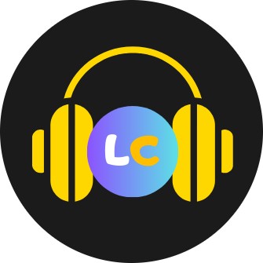

# Hi there! I'm Mohamad Salman 👋

Frontend Software Engineer. I absolutely love web development!

## Open Source Contribution

I really enjoy contributing to open-source projects

- [freeCodeCamp](https://github.com/freeCodeCamp/freeCodeCamp) Contributor
- [Bootstrap](https://github.com/twbs/bootstrap) Contributor

## Instructor
I love teaching coding and sharing knowledge with others.

Instructor on [Udemy](https://www.udemy.com/user/hamude-52/)   
350+ Students

## Socials

  

## Support My Passion

